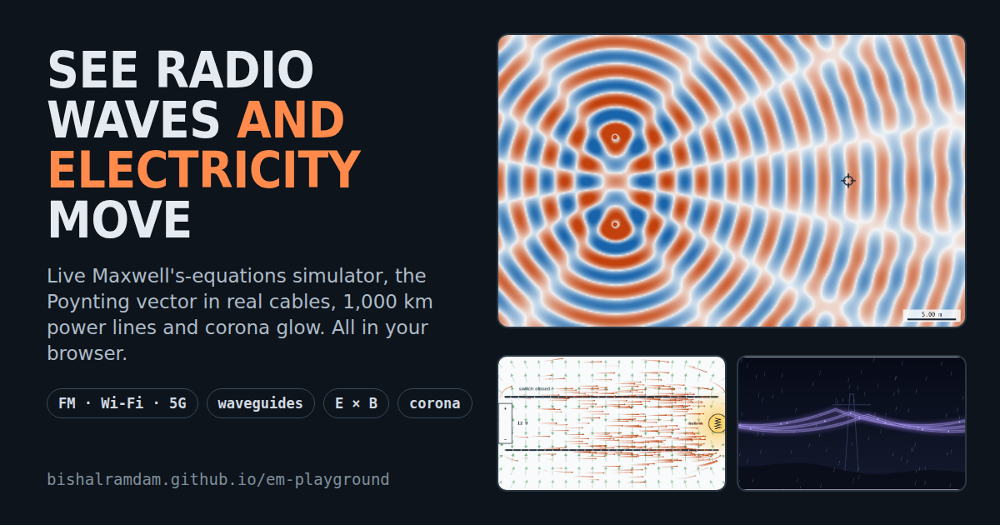

# EM Playground

Interactive physics labs that show radio waves and electricity moving, computed live from Maxwell's equations.

**Live site:** https://bishalramdam.github.io/em-playground/

## Labs

- **[Radio Wave Bench](https://bishalramdam.github.io/em-playground/radio-wave-bench.html)**: a 2D FDTD Maxwell solver (place antennas, draw metal, glass and concrete), FM modulation, ionosphere, waveguides, wave packets and wavelets, Wi-Fi coverage.
- **[Wire Energy Playground](https://bishalramdam.github.io/em-playground/wire-energy-playground.html)**: the Poynting vector S = E × B / μ₀ in circuits and real cables (twisted pair, coax, house wiring, 3-phase), long transmission lines from 50 to 1,000 km using the exact telegrapher equations, and corona discharge using Peek's model.

## Run locally

No build step and no dependencies. Open `index.html` in any modern browser.

## Notes on the physics

- The wave tank is a 2D TMz finite-difference time-domain (FDTD) simulation with absorbing edges and a Drude plasma for the ionosphere.
- Cable fields come from line charges and currents; overhead-line charges are solved with Maxwell's potential coefficients and ground images.
- Long lines use the hyperbolic (distributed-parameter) solution with typical per-km parameters.
- Corona uses Peek's empirical formulas, which are known to overestimate losses on modern lines.

Inspired in part by Veritasium's video "The Big Misconception About Electricity".

## License

MIT
